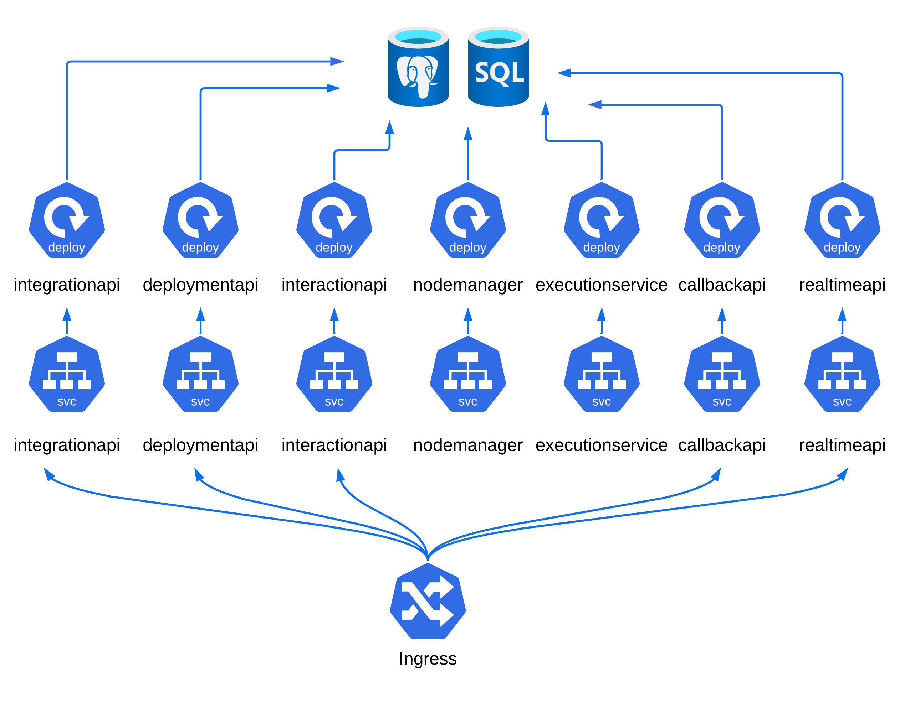
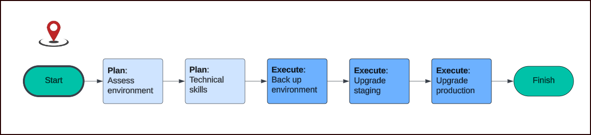

## Redpoint Interaction (RPI) | Deployment on Kubernetes

With Redpoint® Interaction you can define your audience and execute highly personalized, cross-channel campaigns – all from a single visual interface. This simplified environment frees you up to create the compelling experiences that will keep your customers actively engaged with your brand.

This chart deploys RPI on Kubernetes using Helm.

---
<p align="left">
  <a href="docs/greenfield.md"><strong>New Installation</strong></a>&nbsp;&nbsp;|&nbsp;&nbsp;
  <a href="docs/migration.md"><strong>Upgrade from v7.6</strong></a>&nbsp;&nbsp;|&nbsp;&nbsp;
  <a href="docs/readme-configuration.md"><strong>Configuration</strong></a>&nbsp;&nbsp;|&nbsp;&nbsp;
  <a href="docs/readme-values.md"><strong>Values Guide</strong></a>&nbsp;&nbsp;|&nbsp;&nbsp;
  <a href="docs/readme-argocd.md"><strong>GitOps Guide</strong></a>&nbsp;&nbsp;|&nbsp;&nbsp;
  <a href="docs/readme-mcp.md"><strong>MCP Guide</strong></a>
</p>

---


---

## Choose Your Path

| | New Installation | Upgrading from v7.6 |
|:---|:---|:---|
| **Guide** | [Greenfield Installation](docs/greenfield.md) | [Migration Guide](docs/migration.md) |
| **Environment** | New cluster, databases, cache, and queue providers | Existing v7.6 deployment with existing infrastructure |
| **Databases** | Created from scratch | Existing databases are reused |
| **Overrides** | Generate with the [Interaction CLI](docs/greenfield.md#2-quick-start-with-the-interaction-cli) | Convert your existing `values.yaml` to the new format |

> **Quick Start (Demo Mode):** For evaluation or development, run the [Interaction CLI](docs/greenfield.md#2-quick-start-with-the-interaction-cli) and select `demo` mode. This deploys embedded MSSQL and MongoDB containers with no external database setup required.



---

## System Requirements

| Component | Requirement |
|-----------|-------------|
| **Operational** | Microsoft SQL Server 2019+, PostgreSQL — on `SQLServer on VM`, `AzureSQLDatabase`, `AmazonRDSSQL`, `GoogleCloudSQL`, or `PostgreSQL`. 8 GB RAM, 200 GB disk minimum. |
| **Warehouses** | `AzureSQLDatabase`, `AmazonRDSSQL`, `GoogleCloudSQL`, `SQLServer on VM`, `Snowflake`, `PostgreSQL`, `Amazon Redshift`, `Google BigQuery` |
| **Kubernetes** | Latest stable version from a [certified provider](https://kubernetes.io/docs/setup/production-environment/turnkey-solutions/). Minimum two nodes (8 vCPU, 32 GB RAM each). |

**Example node SKUs:**

| Azure | AWS | GCP |
|-------|-----|-----|
| D8s_v5 | m5.2xlarge | n2-standard-8 |

These specs are for a modest environment. Adjust based on your production workloads.

## Prerequisites

Before starting, ensure you have:

- **Redpoint Container Registry** — Open a [Support](mailto:support@redpointglobal.com) ticket requesting access to download RPI images.
- **RPI License** — Open a [Support](mailto:support@redpointglobal.com) ticket to obtain your RPI v7 license activation key.
- **kubectl** — Install [kubectl](https://kubernetes.io/docs/tasks/tools/install-kubectl-linux/) for interacting with your Kubernetes cluster.
- **Helm** — Install [Helm](https://helm.sh/docs/helm/helm_install/) and ensure you have the required permissions for your target cluster.

## Repository Structure

```
redpoint-rpi/
├── chart/                        # Helm chart (don't edit)
│   ├── Chart.yaml
│   ├── values.yaml               # Chart defaults
│   └── templates/
│       ├── _defaults.tpl         # Internal defaults
│       ├── _helpers.tpl          # Merge helpers
│       └── deploy-*.yaml         # Resource templates
├── deploy/
│   ├── cli/interactioncli.sh     # Interaction CLI — deployment generator
│   ├── terraform/modules/        # IaC modules (Azure, AWS, GCP)
│   └── values/                   # Your environment overrides
│       ├── azure/azure.yaml      # Azure example
│       ├── aws/amazon.yaml       # AWS example
│       └── demo/demo.yaml        # Demo/dev example
├── docs/                         # Deployment guides
│   ├── greenfield.md             # New installation guide
│   ├── migration.md              # v7.6 → v7.7 upgrade guide
│   ├── readme-configuration.md   # Configuration reference
│   ├── readme-values.md          # Values & overrides guide
│   ├── readme-argocd.md          # ArgoCD deployment guide
│   ├── readme-mcp.md             # AI-assisted operations guide
│   ├── readme-terraform.md       # Terraform deployment guide
│   ├── smartActivation.md        # Smart Activation guide
│   └── values-reference.yaml     # Complete reference of all keys
└── README.md
```

---

## Configuration

After completing either the [Greenfield](docs/greenfield.md) or [Migration](docs/migration.md) guide, see the **[Configuration Reference](docs/readme-configuration.md)** for optional features including cloud identity, secrets management, storage, Realtime API, autoscaling, service mesh, SSO, and more.

The [Interaction CLI](docs/greenfield.md#2-quick-start-with-the-interaction-cli) generates commented-out examples for each feature in your overrides file. For the complete list of every key, see [values-reference.yaml](docs/values-reference.yaml).

After install or upgrade, run `helm test rpi -n redpoint-rpi` to verify all services are healthy.

---

## AI-Assisted Operations

- **`values.schema.json`** — IDE autocomplete and Helm-native validation. Bundled with the chart, no setup required.
- **`@redpoint-rpi/helm-mcp`** — AI assistants validate configs, generate overrides, render templates, and diagnose issues via [MCP](https://modelcontextprotocol.io).

See [readme-mcp.md](docs/readme-mcp.md) for setup.

---

## Customizing This Helm Chart

The chart uses a **two-tier values system**: a small overrides file with your customizations, and internal defaults managed by the chart. See [readme-values.md](docs/readme-values.md) for details.

Every internal default (probes, security contexts, logging, ports, rollout strategies, thread pools) can be overridden via the `advanced:` block without forking the chart. See [docs/values-reference.yaml](docs/values-reference.yaml) for every available key.

## RPI Documentation

Visit the [RPI Documentation Site](https://docs.redpointglobal.com/rpi/) for in-depth guides and release notes.

## Getting Support

For RPI application issues, contact [support@redpointglobal.com](mailto:support@redpointglobal.com).

> **Scope of Support:** Redpoint supports RPI application issues. Kubernetes infrastructure, networking, and external system configuration fall outside our support scope — consult your IT infrastructure team or relevant technical forums for those.
