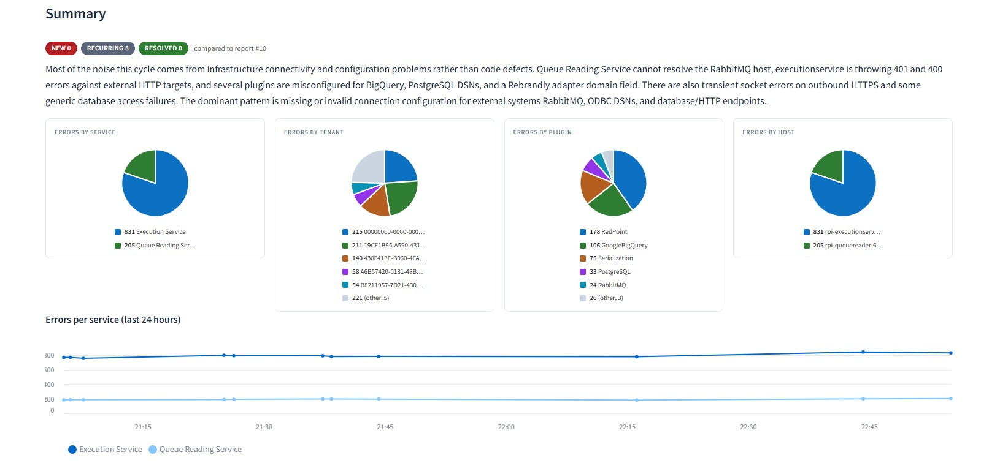
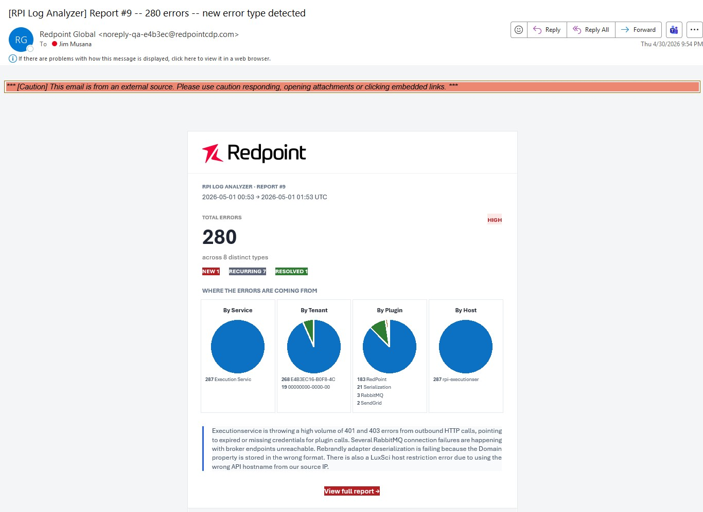
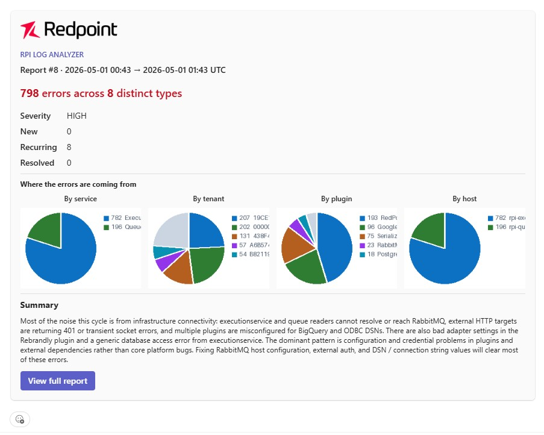

# Log Analyzer

[< Back to Home](../README.md)



## Overview

The **Log Analyzer** is an operations component for RPI that reads recent error rows from the Pulse Logging database, groups identical errors together, and produces a per-cycle report showing what is failing, where, and how often. The same report is sent to email and Microsoft Teams.

It is built for SRE teams who want a single operations view of error activity across services, tenants, plugins, and hosts without having to query Pulse Logging by hand or watch a dashboard. It does not replace your APM, metrics, or paging stack. It complements them by giving you a scheduled (daily or interval) operations digest with a small dashboard for follow-up investigation.

The component runs in the same cluster and namespace as the rest of the RPI services. It connects to Pulse Logging using the chart's existing operational database credentials. It writes its own report history to a local SQLite database on a dedicated volume.

---

<details>
<summary><strong style="font-size:1.25em;">Prerequisites</strong></summary>

Provision the model backend before turning on the analyzer. Pick one provider. The analyzer only calls the model on each cycle (not per error row), so traffic is light, but the resource has to exist and be reachable from the cluster.

### Azure (Azure OpenAI / AI Foundry)

- Azure OpenAI or AI Foundry resource deployed in the target subscription.
- A model deployment on that resource (for example, a `gpt-5` deployment).
- Endpoint, API version, and deployment name. The analyzer reads these via the chart-wide `redpointAI.naturalLanguage` block (`ApiBase`, `ApiVersion`, `ChatGptEngine`), so set them once and the rest of RPI plus the analyzer share them.
- Authentication: an API key in `redpoint-rpi-secrets` under `RPI_NLP_API_KEY`.
- Network egress from the cluster to the OpenAI endpoint. Private Endpoint is supported.

### AWS (Bedrock)

- Bedrock service available in the target region. Not every region carries every model.
- **Model access approved** in the Bedrock console for the `modelId` you plan to use. This is a manual approval step that takes from minutes to a few hours.
- Add `bedrock:InvokeModel` (on the target model ARN) to the IAM role RPI already uses (`cloudIdentity.amazon.roleArn` from your existing overrides). The analyzer rides the chart's standard IRSA / EKS Pod Identity binding, so no new role or trust relationship is needed.
- Network egress from the cluster to `bedrock-runtime.<region>.amazonaws.com`. PrivateLink is supported.

### GCP (Vertex AI)

- Vertex AI API enabled on the project.
- For Anthropic-on-Vertex: model access enabled (request flow in the console, similar to Bedrock).
- Grant `roles/aiplatform.user` (or the narrower `aiplatform.endpoints.predict`) to the GCP service account RPI already uses (`cloudIdentity.google.serviceAccountEmail` from your existing overrides). The analyzer rides the chart's standard Workload Identity binding, so no new service account or federation setup is needed.
- Network egress to `<region>-aiplatform.googleapis.com`.

</details>

<details>
<summary><strong style="font-size:1.25em;">What it does</strong></summary>

Each cycle:

1. Queries Pulse Logging for rows logged in the lookback window (60 minutes in interval mode, 24 hours in daily mode).
2. Filters out rows below the configured severity floor.
3. Groups errors by their root pattern. Volatile content (timestamps, IDs, IP addresses, paths) is stripped before grouping, so different variants of the same underlying error land together.
4. Aggregates totals by service, tenant, plugin, and host.
5. For each cluster, asks the configured model to produce a short explanation of what the error means and a suggested fix. Also asks for a 2 to 4 sentence summary of the cycle as a whole.
6. Persists the full report to a local SQLite store.
7. Marks each error type as `new`, `recurring`, or `resolved`. An error is `new` the first time it ever appears in any report; after that it is `recurring`. An error is `resolved` if it was in the previous report but is not in the current one.
8. Sends an HTML email digest and a Teams Adaptive Card if either channel is enabled and the trigger gates pass.

The dashboard at `https://<your-ingress>/` shows the latest report at the top, four breakdown pies, a 24-hour trend chart per service, and per-cluster cards with the explanation and suggested fix.

</details>

<details>
<summary><strong style="font-size:1.25em;">How it works</strong></summary>

### Schedule modes

The analyzer supports two scheduling modes.

| Mode | When it fires | Use case |
|:-----|:--------------|:---------|
| **Interval** (default) | Every `intervalMinutes` after pod startup | Active monitoring, short reaction time |
| **Daily** | Once a day at `dailyAtUtc` (`HH:MM` in UTC) | Operations digest at a fixed time |

In daily mode the lookback window auto-defaults to 24 hours so consecutive cycles cover the full day. Daily mode also bypasses the `onlyOnNewErrors` gate on both email and Teams: the assumption is that if you opted into a daily summary, you want it every day even on quiet days.

The **Run analysis now** button in the sidebar (and `POST /api/analyze`) fires an off-schedule cycle. Same downstream code path, so it produces a real report and triggers the email and Teams senders.

### Storage

The analyzer keeps its report history in SQLite at `/data/reports.db`. SQLite needs a filesystem that honors POSIX byte-range locks, so `/data` must be backed by block storage (Azure Disk, AWS EBS, GCP PD). Network file shares such as Azure Files or NFS will not work for this volume because their lock semantics break SQLite.

The chart uses a `volumeClaimTemplates` block on a single-replica StatefulSet. This is the same pattern Redis and RabbitMQ use. By default the StorageClass is left empty so the cluster default is used. You can also bring your own PVC via `storage.existingClaim`.

### AI deployment postures

The analyzer treats AI inference as a deployment-posture decision: where inference runs, who operates it, and where log data lives. The user experience is identical across postures; only the deployment architecture differs.

| Posture | What it is | Privacy boundary | Operational ownership |
|:--------|:-----------|:-----------------|:----------------------|
| **`helmAssistant`** (default, turnkey) | Inference runs on the Redpoint-hosted control plane. Redacted, clustered error data is shipped over HTTPS; structured AI summaries come back. Zero customer AI infrastructure required. | redacted samples leave the cluster | Redpoint-managed |
| **`localLlm`** (private, packaged) | Inference runs in-cluster via the chart-shipped Ollama deployment. No log data leaves the customer network. Designed for highly regulated environments. | nothing leaves the cluster | customer (in-cluster) |
| **`byo`** (customer-managed) | Customer-managed inference platform you choose under `byo.platform` (Azure AI Foundry, AWS Bedrock, Google Vertex AI, direct Anthropic). Auth piggybacks on the chart's existing `cloudIdentity` helpers. | customer-managed | customer |

For `byo`, the supported platforms are:

| `byo.platform` | Configuration |
|:---------------|:--------------|
| `anthropic` | API key stored in the cloud vault under `LogAnalyzer-AnthropicApiKey`. |
| `azureFoundry` | Reuses the chart-wide `redpointAI.naturalLanguage` block (`ApiBase`, `ApiVersion`, `ChatGptEngine`). |
| `bedrock` | Authentication via `cloudIdentity.amazon` (IRSA / EKS Pod Identity). Permission needed: `bedrock:InvokeModel` on the target model. |
| `vertex` | Authentication via `cloudIdentity.google` (Workload Identity). Permission needed: `aiplatform.endpoints.predict`. |

The model is called per cycle, not per row. Token and request rate limits are enforced inside the analyzer via `budget.maxTokensPerHour` and `budget.maxRequestsPerHour`. When a budget is exceeded the next cycle is skipped and the budget event is logged.

</details>

<details>
<summary><strong style="font-size:1.25em;">Configuration</strong></summary>

The analyzer is opt-in. Add the following block to your overrides.

### Example A: `helmAssistant` (default, turnkey)

Best out-of-the-box experience. Zero AI infrastructure required.

```yaml
logAnalyzer:
  enabled: true
  # model.provider defaults to helmAssistant; URL is pre-set in the chart.
  schedule:
    dailyAtUtc: "00:00"             # daily mode, 24 h lookback (auto)
  email:
    enabled: true
    recipients:
      - sre@example.com
  teams:
    enabled: true                   # webhookSecretKey defaults to LogAnalyzer_Teams_Webhook
  storage:
    volumeClaimTemplates:
      enabled: true
      accessModes: ReadWriteOnce
      storage: 5Gi
      storageClassName: ""          # empty = cluster default storage class
```

The Helm Assistant API key drops into the `redpoint-rpi-secrets` Secret under the fixed key `LogAnalyzer_HelmAssistant_ApiKey` (format: `<username>:<password>`).

### Example B: `localLlm` (private, packaged in-cluster)

Inference runs in-cluster via Ollama; no log data leaves the network.

```yaml
logAnalyzer:
  enabled: true
  model:
    provider: localLlm
    llmName: phi3:mini              # any tag from https://ollama.com/library
  localLlm:
    enabled: true                   # opt in to the in-cluster Ollama deployment
  schedule:
    intervalMinutes: 30
    lookbackMinutes: 60
```

### Example C: `byo` + AWS Bedrock (customer-managed)

Customer-managed inference platform; auth via `cloudIdentity.amazon`.

```yaml
logAnalyzer:
  enabled: true
  model:
    provider: byo
    llmName: anthropic.claude-sonnet-4-20250514-v1:0
    byo:
      platform: bedrock
      bedrock:
        region: us-east-1
  email:
    enabled: true
    recipients:
      - sre@example.com
    onlyOnNewErrors: true           # only when at least one cluster is first-seen

cloudIdentity:
  amazon:
    roleArn: arn:aws:iam::123456789012:role/rpi-loganalyzer
```

The IAM role above needs `bedrock:InvokeModel` on the target model. No separate API key.

For `byo` + Anthropic, set `byo.platform: anthropic` and `byo.anthropic.apiKeyVaultEntry`. For `byo` + Vertex, set `byo.platform: vertex` and `byo.vertex.{projectId, region}`. For `byo` + Azure Foundry, set `byo.platform: azureFoundry` and configure `redpointAI.naturalLanguage` chart-wide.

### Reference

| Key | Default | Description |
|:----|:--------|:------------|
| `enabled` | `false` | Master switch. |
| `model.provider` | `helmAssistant` | AI deployment posture. `helmAssistant` (managed control plane), `localLlm` (packaged in-cluster Ollama), or `byo` (customer-managed AI platform). |
| `model.llmName` | `""` | Model identifier for the active posture. Ignored when `provider=helmAssistant` (control plane selects model) and when `byo.platform=azureFoundry` (uses `redpointAI.naturalLanguage.ChatGptEngine`). |
| `model.helmAssistant.url` | `https://rpi-helm-assistant.redpointcdp.com` | Redpoint Helm Assistant control-plane URL. Required when `provider=helmAssistant`. |
| `model.byo.platform` | _(unset)_ | Required when `provider=byo`. One of: `anthropic`, `azureFoundry`, `bedrock`, `vertex`. |
| `localLlm.enabled` | `false` | Deploy the in-cluster Ollama backend. Must be `true` when `provider=localLlm`. |
| `schedule.intervalMinutes` | `30` | Interval mode period. Ignored when `dailyAtUtc` is set. |
| `schedule.dailyAtUtc` | `""` | Daily mode time as `HH:MM` UTC. Empty = interval mode. |
| `schedule.lookbackMinutes` | auto | How far back each cycle queries. Defaults to 60 in interval mode, 1440 in daily mode. Override with an integer if needed. |
| `schedule.onDemandEnabled` | `true` | Exposes `POST /api/analyze`. Set `false` to disable the Run-now button and on-demand endpoint. |
| `budget.maxTokensPerHour` | `200000` | Hard cap. Exceeding skips the next cycle. |
| `budget.maxRequestsPerHour` | `60` | Hard cap. Exceeding skips the next cycle. |
| `email.enabled` | `false` | Send the cycle digest as HTML email. |
| `email.recipients` | `[]` | List of email addresses. |
| `email.onlyOnNewErrors` | `true` | If true, skip cycles with no first-seen error types. Bypassed in daily mode. |
| `teams.enabled` | `false` | Post the cycle digest to a Teams channel. |
| `teams.webhookSecretKey` | `LogAnalyzer_Teams_Webhook` | Key in `redpoint-rpi-secrets` holding the webhook URL. |
| `teams.onlyOnNewErrors` | `true` | Same semantics as `email.onlyOnNewErrors`. Bypassed in daily mode. |
| `storage.existingClaim` | `""` | Mount an existing PVC instead of provisioning a new one. |
| `storage.volumeClaimTemplates.enabled` | `true` | Provision the volume via StatefulSet `volumeClaimTemplates`. |
| `storage.volumeClaimTemplates.storage` | `5Gi` | Volume size. |
| `storage.volumeClaimTemplates.storageClassName` | `""` | Empty = use cluster default. |

</details>

<details>
<summary><strong style="font-size:1.25em;">Notifications</strong></summary>

### Email

The analyzer reuses the chart-wide `SMTPSettings` block (the same SMTP server, sender address, and credentials the .NET RPI services already use). No analyzer-specific SMTP configuration is required.

The HTML body shows total errors, the new / recurring / resolved breakdown pills, four breakdown pies (service, tenant, plugin, host), the cycle summary, and a button that links back to the dashboard.



### Microsoft Teams

The Teams card is posted to a Workflow incoming webhook. To get the URL:

1. In the target Teams channel, click `...` -> `Workflows`.
2. Pick the template `Post to a channel when a webhook request is received`.
3. Copy the URL the workflow generates.
4. Store it in `redpoint-rpi-secrets` under the key `LogAnalyzer_Teams_Webhook` (override with `teams.webhookSecretKey` if you use a different key).

The card mirrors the email content. The Redpoint logo and the four breakdown pies are inlined into the card payload as base64 data URIs. This means the card renders correctly even when the analyzer's ingress is private. Teams' image renderers run on Microsoft's public infrastructure and would not be able to fetch images from a private host, but data URIs do not require a network fetch.



### Trigger gates

A digest fires only when all of these are true:

| Channel | Gates |
|:--------|:------|
| Email | `email.enabled`, recipients list non-empty, SMTP address and sender address configured. |
| Teams | `teams.enabled`, webhook URL present in the secret. |
| Both | Cycle has at least one `new` (first-seen) error type, **unless** `onlyOnNewErrors: false` or daily mode is on. |

</details>

<details>
<summary><strong style="font-size:1.25em;">Access and operations</strong></summary>

### Ingress

Add a host entry under your existing `ingress.hosts` block:

```yaml
ingress:
  domain: example.com
  hosts:
    loganalyzer: rpi-loganalyzer        # final URL: https://rpi-loganalyzer.example.com
```

The chart wires this into the analyzer's `LOG_ANALYZER__EMAIL__INGRESS_URL` env so the email and Teams CTA buttons link back to a working dashboard URL.

### Dashboard

The Streamlit UI at the ingress URL has these sections:

| Section | What it shows |
|:--------|:--------------|
| Summary | Status pills (NEW / RECURRING / RESOLVED), the cycle's prose summary, and the comparison report ID. |
| Breakdown pies | Four pies: errors by service, tenant, plugin, host. Top 5 each, with the rest grouped under `(other)`. |
| 24-hour trend | One line per service across the last 24 hours of cycles. |
| Error details | Per-cluster cards. Each card shows the count, source, headline message, a short explanation, and a suggested fix. Cards are color-coded by severity. |
| Downloads | Recent reports with a per-cycle log download. The download contains every persisted row from every cluster (raw, untruncated). Hand off to dev for deeper analysis. |

### Internal API (not on the public ingress)

The pod runs two processes:

| Process | Port | Reachable from |
|:--------|:-----|:---------------|
| Streamlit UI | `8501` | The public ingress (this is what operators see). |
| FastAPI | `8080` | Inside the pod only. The Streamlit UI calls it on `localhost`. Kubelet hits it for probes. |

The FastAPI port is intentionally not added to the K8s Service, so the dashboard URL is the only externally reachable surface. Hitting `/api/...` on the public ingress returns the Streamlit HTML shell, not JSON.

For ad-hoc inspection of the internal API (token budget, raw report payload, on-demand cycle), use a port-forward:

```bash
kubectl port-forward -n <namespace> pod/rpi-loganalyzer-0 8080:8080
curl http://localhost:8080/api/budget
```

Available endpoints:

| Endpoint | Purpose |
|:---------|:--------|
| `GET /health/live` | Liveness probe. |
| `GET /health/ready` | Readiness probe. Fails if the report store is not initialized. |
| `GET /api/reports` | List recent reports (id, started_at, error_count, token usage). |
| `GET /api/reports/{id}` | Single report payload. |
| `GET /api/reports/{id}/export.txt` | Plain-text dump of every row in every cluster for that report. |
| `GET /api/trend` | Per-cycle time series for the last 24 hours. |
| `GET /api/budget` | Current token / request budget status. |
| `GET /api/settings` | Read-only summary of the active configuration. |
| `POST /api/analyze` | Fire an off-schedule cycle. Returns the new report. Disable via `schedule.onDemandEnabled: false`. |

The dashboard sidebar shows the same token-budget figures as `GET /api/budget` so you do not need a port-forward for routine viewing.

### Logs and probes

The analyzer pod logs cycle results, scheduling decisions, and notification outcomes. Sample lines worth knowing:

```
INFO  app.scheduler scheduler running in daily mode at 00:00 UTC
INFO  app.scheduler next cycle in 32400 s (daily at 00:00 UTC)
INFO  app.analyze.pipeline cycle complete: report_id=42 errors=511 clusters=8
INFO  app.email_sender email digest sent: report=#42 recipients=1
INFO  app.teams_sender Teams notification sent: report=#42
INFO  app.teams_sender Teams notification skipped: no first-seen errors this cycle
```

</details>

---

## Day-2 operations

For operators running the Log Analyzer in production, see the **[Log Analyzer Operations Guide](loganalyzer-ops.md)**. It covers what every dashboard label means, how the schedule and lookback windows work (including how long it takes a fix to show as `Resolved`), notification trigger gates, the token budget, and troubleshooting the most common failure modes.

---
<sub>Redpoint Interaction v7.7 | [Helm Assistant](https://rpi-helm-assistant.redpointcdp.com) | [Support](mailto:support@redpointglobal.com) | [redpointglobal.com](https://www.redpointglobal.com)</sub>
