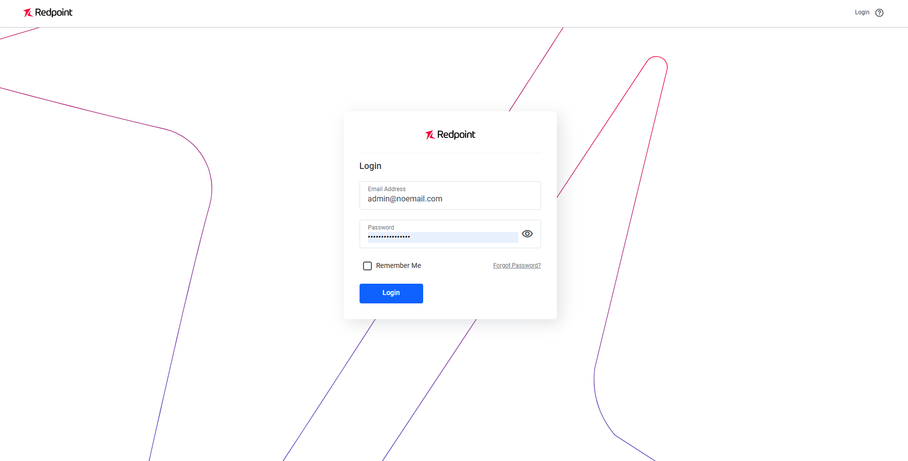

# Smart Activation

[< Back to main README](../README.md)

[RPI Smart Activation](https://docs.redpointglobal.com/cdp/data-activation-overview-page) adds a web-based UI for building segments, audiences, and data activations on top of RPI. It is disabled by default and deployed only when explicitly enabled.

> **Advisory:** We recommend you **do not** enable Smart Activation at this time. Contact your Redpoint representative for further details.

---

## System Requirements

| Component | Requirement |
|-----------|-------------|
| **MongoDB** | Version 7.x on `MongoDB on VM` or `MongoDB Atlas`. Minimum 8 GB RAM (VM) or M20 General (Atlas). 100 GB free disk. |
| **SQL Server** | Required for the Keycloak database. Use the same SQL Server instance that hosts the RPI operational databases. |

## Prerequisites

Before enabling Smart Activation, ensure you have:

- **Container Registry:** Open a [Support](mailto:support@redpointglobal.com) ticket requesting access to download the RPI Smart Activation images.
- **Activation License:** Open a [Support](mailto:support@redpointglobal.com) ticket to obtain the RPI Smart Activation license key.
- **Integration API Service Account:** Create a service account within RPI that Smart Activation uses to communicate with the Integration API. The account must be a member of these RPI groups:
  - `Everyone`
  - `IntegrationAPI`
  - `Cluster Administrators`

---

## Deployment

### 1. Enable Smart Activation

Add the following to your overrides file:

```yaml
smartActivation:
  enabled: true

# Integration API service account credentials (must match the RPI service account)
integrationapi:
  username: admin@noemail.com
  password: <my-secure-password>

# Web UI administrator credentials
authservice:
  default_username: admin@noemail.com
  default_password: <my-secure-password>

# Keycloak administrator credentials
keycloak:
  username: admin@noemail.com
  password: <my-secure-password>
  database_name: keycloak

# Smart Activation operational database (MongoDB)
initservice:
  database:
    operational:
      name: smart_activation_db
      connection_string: mongodb+srv://<username>:<password>@<hostname>/?retryWrites=true&w=majority
```

Deploy with Helm:

```bash
helm upgrade --install rpi ./chart -f my-overrides.yaml -n redpoint-rpi
```

### 2. Verify Deployment

When Smart Activation is enabled, the following services are deployed to your RPI namespace:

| Service | Description |
|---------|-------------|
| `cdp-authservices` | Authentication service |
| `cdp-cache` | Caching layer |
| `cdp-initservice` | Database initialization |
| `keycloak` | Identity provider |
| `cdp-maintenanceservice` | Background maintenance |
| `cdp-messageq` | Message queue |
| `cdp-servicesapi` | Core API |
| `cdp-socketio` | Real-time websocket |
| `cdp-ui` | Web UI |

Verify all pods are running:

```bash
kubectl get pods -n redpoint-rpi -l app.kubernetes.io/component=smart-activation
```

Review pod logs and address any startup errors before proceeding.

### 3. Configure Ingress

The Web UI is exposed through your existing RPI ingress. Set the hostname in your overrides file:

```yaml
ingress:
  hosts:
    smartactivation: rpi-webui
```

The UI will be available at `https://rpi-webui.<your-domain>`.

---

## Post-Deployment Configuration

### Activate the License

```bash
WEBUI_URL=https://rpi-webui.example.com
ADMIN_USERNAME=admin@noemail.com
ADMIN_PASSWORD=<admin-password>
LICENSE_KEY=<my-license-key>
RPI_CLIENT_ID=<my-rpi-client-id>

# Get authentication token
AUTH_TOKEN=$(curl -s -X POST \
  "$WEBUI_URL/api/v1/auth/signon-admin" \
  -H "Content-Type: application/json" \
  -d '{
    "username": "'"$ADMIN_USERNAME"'",
    "password": "'"$ADMIN_PASSWORD"'"
  }' | jq -r '.accessToken')

# Activate the license
curl -X POST \
  "$WEBUI_URL/api/v1/license/activate" \
  -H "Authorization: Bearer $AUTH_TOKEN" \
  -H "Content-Type: application/json" \
  -d '{
    "activationKey": "'"$LICENSE_KEY"'"
  }'
```

### Configure the Web Client

```bash
curl -X PUT \
  "$WEBUI_URL/api/v1/clients/$RPI_CLIENT_ID/config" \
  -H "Authorization: Bearer $AUTH_TOKEN" \
  -H "Content-Type: application/json" \
  -d '{
    "dccEnabled": true,
    "name": "my-smart-activation-client",
    "abbvName": "my-sa-client",
    "description": "My Smart Activation client",
    "siteUrl": "'"$WEBUI_URL"'",
    "keycloakEnabled": false,
    "models": ["Core", "Retail", "IR"],
    "keycloakRealm": "redpoint-mercury",
    "apps": {
      "campaign_creation": {
        "enabled": true
      },
      "machine_learning": {
        "enabled": false,
        "finiteStateMachineEnabled": false
      },
      "in_situ": {
        "enabled": false,
        "dmConfig": []
      }
    }
  }'
```

The Web UI should now be accessible at `https://rpi-webui.<your-domain>`.



---

## RPI Documentation

Visit the [RPI Documentation Site]("https://docs.redpointglobal.com/rpi/") for in-depth guides and release notes.

## Getting Support

For RPI application issues, contact [support@redpointglobal.com](mailto:support@redpointglobal.com).

> **Scope of Support:** Redpoint supports RPI application issues. Kubernetes infrastructure, networking, and external system configuration fall outside our support scope. Consult your IT infrastructure team or relevant technical forums for those.

---
<sub>Redpoint Interaction v7.7 | [Helm Assistant](https://rpi-helm-assistant.redpointcdp.com) | [Support](mailto:support@redpointglobal.com) | [redpointglobal.com](https://www.redpointglobal.com)</sub>
